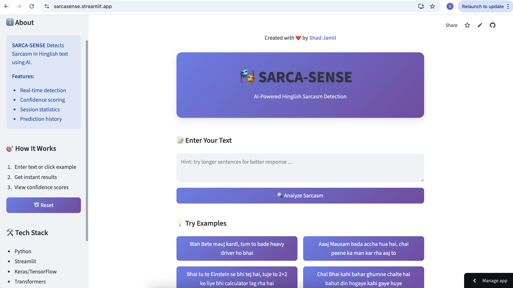

# 🎭 SARCA-SENSE


A simple web app that detects sarcasm in Hinglish (Hindi + English) text using Machine Learning.


**Live Demo:** [Try it here!](https://sarcasense.streamlit.app)




## 🚀 What is this?


SARCA-SENSE is a sarcasm detection tool powered by state of the art AI tech like transformers. It analyzes code-mixed Hinglish sentences and tells you whether they're sarcastic or not. Perfect for understanding the tone of social media comments, messages, and everyday conversations!


## ✨ Features


- 🔍 Real-time sarcasm detection
- 💬 Supports Hinglish (Hindi + English mixed text)
- 📊 Shows confidence scores
- 💡 Pre-loaded examples to try
- 📈 Session statistics


## 🛠️ Tech Stack


- **Python** - Programming language
- **Streamlit** - Web framework
- **Keras/TensorFlow** - Deep learning
- **scikit-learn** - Machine learning tools
- **TF-IDF** - Text feature extraction


## 📦 Installation


1. **Clone this repo**
```bash
git clone https://github.com/yourusername/sarca-sense.git
cd sarca-sense
```


2. **Install dependencies**
```bash
pip install -r requirements.txt
```


3. **Run the app**
```bash
streamlit run app.py
```


The app will open in your browser at `http://localhost:8501`


## 📁 Project Structure


```
sarca-sense/
├── app.py                    # Main Streamlit app
├── model.py                  # Model and preprocessing
├── src/
│   └── mlp_model.keras      # Trained model file
├── requirements.txt          # Dependencies
└── README.md                # This file
```


## 🎯 How to Use


1. Enter a Hinglish sentence in the text box
2. Click "Analyze Sarcasm" or try the example buttons
3. See if it's sarcastic or not with confidence score!


## 🧠 Model Info


- **Architecture:** Multi-Layer Perceptron (MLP)
- **Features:** XLM-RoBERTa
- **Training:** Supervised learning on labeled Hinglish dataset
- **Output:** Binary classification with confidence score


## 📝 Requirements


```
streamlit
keras
tensorflow
numpy
pandas
scikit-learn
```


## 🚀 Deployment


This app is deployed on **Streamlit Cloud** (free tier). To deploy your own:


1. Push code to GitHub
2. Go to [share.streamlit.io](https://share.streamlit.io)
3. Connect your repo and deploy!


## 🤝 Contributing


Feel free to fork this project and submit pull requests. For major changes, please open an issue first.


## 📄 License


MIT License - feel free to use this project for learning!


## 👨‍💻 Author


**Shad Jamil**


- Portfolio: [shad-datascience.github.io](https://shad-datascience.github.io)
- GitHub: [@yourusername](https://github.com/shad-datascience)


## 🙏 Acknowledgments


- Thanks to my professors and classmates for their support
- Streamlit for the awesome framework
- Open source community


---


Made with ❤️ | Powered by DL, Transformers & NLP
## 🚀 What is this?


SARCA-SENSE is a sarcasm detection tool built as a college project. It analyzes code-mixed Hinglish sentences and tells you whether they're sarcastic or not. Perfect for understanding the tone of social media comments, messages, and everyday conversations!


## ✨ Features


- 🔍 Real-time sarcasm detection
- 💬 Supports Hinglish (Hindi + English mixed text)
- 📊 Shows confidence scores
- 💡 Pre-loaded examples to try
- 📈 Session statistics


## 🛠️ Tech Stack


- **Python** - Programming language
- **Streamlit** - Web framework
- **Keras/TensorFlow** - Deep learning
- **scikit-learn** - Machine learning tools
- **TF-IDF** - Text feature extraction


## 📦 Installation


1. **Clone this repo**
```bash
git clone https://github.com/yourusername/sarca-sense.git
cd sarca-sense
```


2. **Install dependencies**
```bash
pip install -r requirements.txt
```


3. **Run the app**
```bash
streamlit run app.py
```


The app will open in your browser at `http://localhost:8501`


## 📁 Project Structure


```
sarca-sense/
├── app.py                    # Main Streamlit app
├── model.py                  # Model and preprocessing
├── src/
│   └── mlp_model.keras      # Trained model file
├── requirements.txt          # Dependencies
└── README.md                # This file
```


## 🎯 How to Use


1. Enter a Hinglish sentence in the text box
2. Click "Analyze Sarcasm" or try the example buttons
3. See if it's sarcastic or not with confidence score!


## 🧠 Model Info


- **Architecture:** Multi-Layer Perceptron (MLP)
- **Features:** XLM-RoBERTa
- **Training:** Supervised learning on labeled Hinglish dataset
- **Output:** Binary classification with confidence score


## 📝 Requirements


```
streamlit
keras
tensorflow
numpy
pandas
scikit-learn
```


## 🚀 Deployment


This app is deployed on **Streamlit Cloud** (free tier). To deploy your own:


1. Push code to GitHub
2. Go to [share.streamlit.io](https://share.streamlit.io)
3. Connect your repo and deploy!


## 🤝 Contributing


Feel free to fork this project and submit pull requests. For major changes, please open an issue first.


## 📄 License


MIT License - feel free to use this project for learning!


## 👨‍💻 Author


**Shad Jamil**


- Portfolio: [shad-datascience.github.io](https://shad-datascience.github.io)
- GitHub: [@yourusername](https://github.com/shad-datascience)


## 🙏 Acknowledgments


- Thanks to my professors and classmates for their support
- Streamlit for the awesome framework
- Open source community


---


Made with ❤️ | Powered by DL, Transformers & NLP

